# Helix — Enterprise Agentic AI Operations Platform

Three AI agent pods on one governed backend, with the things that make an AI feature into an AI *product*: authentication, cost telemetry, semantic caching, guardrails, real-time reasoning traces, billing, and a CI gate on answer quality.

```bash
git clone <repo> && cd Helix
docker compose up --build          # the whole stack
python scripts/smoke_test.py       # 10/10 across every pod
```

No API keys needed — the default LLM provider is a deterministic mock that runs entirely offline.

---

## The problem

Getting an LLM to answer a question is a weekend project. Running it as a product is not. In production you have to answer: *Who is asking? What did this cost? Is the answer actually supported by the source? What happens when retrieval fails? How do you know quality didn't regress with today's prompt change? Who pays?*

Helix is built around those questions. The agents are the easy part; the governance around them is the point.

---

## Architecture

```mermaid
graph TB
    subgraph client["Browser"]
        UI["React + TypeScript SPA<br/>live agent trace · admin alerts"]
    end

    subgraph api["FastAPI backend"]
        MW["Auth · RBAC · tier-aware rate limiting"]

        subgraph pods["Agent pods (LangGraph)"]
            P1["<b>Doc Q&A</b><br/>hybrid retrieval → RRF → rerank<br/>→ sufficiency check ⟲ re-query<br/>→ answer → critique → groundedness"]
            P2["<b>Code Review</b><br/>quality ∥ security → summarizer"]
            P3["<b>Support Triage</b><br/>trained classifier → LLM fallback<br/>→ KB retrieval → draft → escalate"]
        end

        CORE["LLMClient · Telemetry · Guardrails<br/>mock | openai | anthropic"]
    end

    subgraph data["State"]
        PG[("Postgres<br/>users · docs · tickets<br/>reviews · request_logs")]
        RD[("Redis<br/>semantic cache · rate limits<br/>session memory · pub/sub")]
        CH[("Chroma<br/>vector index")]
    end

    UI -->|"REST + JWT"| MW
    UI <-->|"WebSocket"| WS["/ws/agent-status<br/>/ws/admin/escalations"]
    MW --> pods
    pods --> CORE
    CORE --> PG
    pods --> CH
    MW --> RD
    pods --> RD
    RD -.->|"pub/sub"| WS
    CORE -->|"cost · latency · quality"| OBS["/observability/summary"]

    style pods fill:#e8f0fe,stroke:#4a6fdc
    style data fill:#f0f7f0,stroke:#1f8a5f
```



---

## What is actually interesting here

### Retrieval that admits when it doesn't know

The Doc Q&A pod is not retrieve-then-generate. Vector search and BM25 run in parallel, merge by **reciprocal rank fusion**, and get **reranked** before an answer agent sees them. Then a sufficiency node judges whether the context can actually answer the question — if not, the query is rewritten using vocabulary observed in the first pass (pseudo-relevance feedback) and retrieval runs again. A final groundedness check rejects answers the context doesn't support.

The result is a pipeline that says **"I could not find that in the provided documents"** instead of confabulating — and the test suite asserts it does.

> Why BM25**Plus**, not BM25Okapi: Okapi's IDF goes negative for any term appearing in more than half the corpus, and `rank_bm25`'s epsilon floor is derived from the *average* IDF, which is itself negative on a small corpus. Every score came back negative and keyword search silently returned nothing. This was caught by a test asserting both retrievers contribute.

### A classifier that is trained, not prompted

Support Triage runs a real scikit-learn pipeline (TF-IDF → logistic regression) before considering an LLM. Above a confidence threshold it classifies the ticket in **under a millisecond for zero marginal cost**; only genuinely ambiguous tickets fall through to an LLM classifier. Which path ran is recorded per request and surfaced on the observability page.

Held-out accuracy, measured on **entirely unseen ticket phrasings** (grouped split by template — a random split scored 1.00 and meant nothing, because paraphrases of the same sentence landed on both sides):

| Task | Accuracy | Majority baseline |
|---|---|---|
| Priority (4 classes) | **0.615** | 0.410 |
| Category (6 classes) | **0.603** | 0.128 |

Modest numbers, honestly measured. `python -m scripts.train_classifier` reproduces them and fails the build if they regress.

### A quality gate that can actually go red

`pytest -k quality_gate` scores a golden dataset on **faithfulness, answer relevance and context precision** via LLM-as-judge, and fails CI if any average drops below its floor. Current run:

```
RAG quality (LLM-as-judge), 12 cases:
  faithfulness       0.983  (floor 0.70, n=12)
  answer_relevance   0.729  (floor 0.70, n=12)
  context_precision  1.000  (floor 0.60, n=10)
```

A companion test deliberately grounds correct answers in unrelated context and **asserts the gate fails** — a gate that cannot go red is decoration.

> Abstentions score `None` for context precision, not `0.0`. Scoring them zero would penalise the pipeline for correctly refusing to answer, quietly pushing it toward answering everything.

### A reasoning trace, not a spinner

Every LangGraph node publishes a structured event over WebSocket while the request is in flight, so the UI shows what the agent is doing:

```
✓ Tool router          No tool required; answering from documents         0ms
✓ Hybrid retriever     Vector 8 + keyword 6 → fused 11 → reranked, kept 4  12ms
✓ Context sufficiency  Insufficient: context does not cover "annual"        3ms
✓ Query reformulation  Reformulated to: "annual plan billing cap limits"    2ms
✓ Hybrid retriever     Vector 8 + keyword 7 → fused 12 → reranked, kept 4  11ms
✓ Answer generation    Answer generated from 4 chunks                       8ms
✓ Groundedness         Grounded (0.94)                                      4ms
```

Each step expands to its structured detail — rerank scores, chunk counts, the reformulated query. Events are buffered and replayed so a socket that connects late still gets the full trace.

> The gateway subscribes to the channel **before** reading the replay buffer. The natural order (replay, then subscribe) drops any event published in the gap — and those steps are gone for good. Caught by the E2E test, which saw a trace that stopped at two steps.

### Tenant isolation that covers both retrievers

Chunks carry their `owner_id`, and **both** the vector query and the BM25 results are filtered on it. Scoping only the vector side would have leaked the identical content straight back through the keyword path — and filtering only the document *listing* (the DB-level owner check) does nothing at all for the index. The semantic cache is namespaced per user for the same reason: a cache keyed only by collection would hand one user an answer generated from another's documents. Three tests hold this down, including one asserting a second user gets `found: false` for a question only the first user's document answers.

### Caching that shows its own value

A semantic cache sits in front of the whole agent graph: questions are embedded and compared to previous ones, so *"How long is the refund window?"* hits the entry stored for *"How long do I have to get a refund?"*. Hits record the cost of the call they avoided, so the observability page reports money actually saved.

Measured under load (see [`load-test/RESULTS.md`](load-test/RESULTS.md)):

| Path | p95 latency | Cost |
|---|---|---|
| Cache hit | **10.7 ms** | $0.00 |
| Full agent graph | **38.5 ms** | ~7 LLM calls |

---

## Skills map

Every claim below points at the file that implements it.

| Area | Where | What it does |
|---|---|---|
| **Authentication** | [`backend/app/auth/router.py`](backend/app/auth/router.py) | JWT access + refresh, single-use rotation, reuse ⇒ family revocation |
| | [`backend/app/core/security.py`](backend/app/core/security.py) | bcrypt via passlib, SHA-256 token hashing, 72-byte guard |
| **Authorization** | [`backend/app/core/deps.py`](backend/app/core/deps.py) | `get_current_user`, `require_role("admin")` factory |
| **Database** | [`backend/app/db/models.py`](backend/app/db/models.py) | 8 tables, async SQLAlchemy 2.0, Postgres + SQLite |
| | [`backend/alembic/`](backend/alembic/) | Migrations from day one; `alembic check` runs in CI |
| **REST API** | [`backend/app/*/router.py`](backend/app/) | 30 endpoints, OpenAPI at `/api-docs` |
| **Caching** | [`backend/app/core/cache.py`](backend/app/core/cache.py) | Semantic cache, sliding-window limiter, pub/sub, in-process fallback |
| **Rate limiting** | [`backend/app/core/rate_limit.py`](backend/app/core/rate_limit.py) | Tier-aware; Pro lifts the limit on the next request |
| **RAG** | [`backend/app/rag/retrieval.py`](backend/app/rag/retrieval.py) | Hybrid search, RRF, cross-encoder rerank (lexical fallback) |
| | [`backend/app/rag/agents.py`](backend/app/rag/agents.py) | Agentic re-query loop, self-critique, groundedness validation |
| **Multi-agent** | [`backend/app/code_review/agents.py`](backend/app/code_review/agents.py) | Parallel LangGraph fan-out/fan-in |
| **Trained ML** | [`backend/scripts/train_classifier.py`](backend/scripts/train_classifier.py) | TF-IDF + logistic regression, grouped held-out evaluation |
| **Guardrails** | [`backend/app/core/guardrails.py`](backend/app/core/guardrails.py) | Schema validation with bounded repair, PII redaction, injection screening |
| **LLMOps** | [`backend/app/core/telemetry.py`](backend/app/core/telemetry.py) | Per-call latency, tokens, cost; buffered writes |
| | [`backend/app/observability/`](backend/app/observability/) | Aggregated dashboard + RAG evaluation metrics |
| **Real-time** | [`backend/app/realtime/gateway.py`](backend/app/realtime/gateway.py) | Trace + escalation WebSockets, JWT at handshake, replay buffer |
| **Payments** | [`backend/app/billing/`](backend/app/billing/) | Stripe checkout, signed webhooks, simulated mode for local dev |
| **Frontend** | [`frontend/src/`](frontend/src/) | React 19 + TS, typed client with shared 401-refresh, live trace UI |
| **Testing** | [`backend/tests/`](backend/tests/) · [`frontend/src/test/`](frontend/src/test/) · [`frontend/e2e/`](frontend/e2e/) | 151 pytest + 43 Vitest + 5 Playwright |
| **Load testing** | [`load-test/`](load-test/) | k6 ramp to 30 VUs with real recorded results |
| **Docker** | [`docker-compose.yml`](docker-compose.yml) | Multi-stage, non-root, healthchecked; verified 10/10 live |
| **CI/CD** | [`.github/workflows/ci.yml`](.github/workflows/ci.yml) | Lint, tests, quality gate, E2E, image build + smoke |
| **Kubernetes** | [`infra/k8s/`](infra/k8s/) | Deployments, HPA, PDB, Ingress — validated with `kubeconform` |
| **Terraform** | [`infra/aws/`](infra/aws/) · [`infra/terraform/`](infra/terraform/) | AWS (Fargate + a $0 free-tier option) and Azure Container Apps, all `terraform validate` clean |

---

## Verified numbers

Everything below was measured on this machine, not estimated.

| | |
|---|---|
| Backend tests | **151 passed** in 38s |
| Frontend tests | **43 passed** |
| E2E tests | **5 passed**, stable across consecutive runs |
| Quality gate | faithfulness **0.983** · relevance **0.729** · precision **1.000** |
| Classifier | priority **0.615** vs 0.410 baseline · category **0.603** vs 0.128 |
| Load test | **5,106 requests**, 50.9 req/s, **p95 19 ms**, 0% failures |
| Cache effect | p95 **10.7 ms** cached vs **38.5 ms** uncached |
| Docker | 4/4 services healthy, **10/10** smoke checks from a clean volume |

> The load-test latencies measure Helix's *orchestration overhead*, not end-to-end product latency — they were run against the mock provider, so there is no model inference in them. [`load-test/RESULTS.md`](load-test/RESULTS.md) explains what does and does not carry over to a real model.

---

## Running it

### Docker (everything)

```bash
docker compose up --build
```

Frontend on `:5173`, API on `:8000`, OpenAPI at `:8000/api-docs`. **The first account you create at `/signup` becomes the administrator.**

### Local development

```bash
# Backend
cd backend
python3.11 -m venv .venv && .venv/bin/pip install -r requirements.txt
.venv/bin/alembic upgrade head
.venv/bin/python -m scripts.train_classifier
.venv/bin/uvicorn app.main:app --reload

# Frontend
cd frontend && npm install && npm run dev
```

SQLite and an in-process Redis substitute are used automatically when Postgres/Redis are absent, so neither is required for local work.

### Using a real model

```bash
LLM_PROVIDER=anthropic ANTHROPIC_API_KEY=sk-ant-… uvicorn app.main:app
```

Set `COST_PER_1K_PROMPT_TOKENS` and `COST_PER_1K_COMPLETION_TOKENS` to your model's real prices, or the cost dashboard reports fiction. See [`backend/.env.example`](backend/.env.example) for every option.

### Tests

```bash
cd backend  && pytest                    # 151 tests
cd backend  && pytest -k quality_gate -s # the RAG quality gate, with scores
cd frontend && npm test                  # 43 component/unit tests
cd frontend && npm run test:e2e          # Playwright (starts both servers)
k6 run load-test/k6-script.js            # load test
```

Deployment: **[DEPLOYMENT.md](DEPLOYMENT.md)**. What's next: **[ROADMAP.md](ROADMAP.md)**.

---

## Design decisions worth defending

**The mock LLM provider reads its prompt.** It is not a stub returning a fixed string — each task has a responder that answers from the context it was given. That is what makes the offline quality gate meaningful: break retrieval and the mock's answers stop being grounded, and faithfulness drops exactly as it would with a real model. It is also why the entire test suite runs with no API keys, no network, and no flakiness.

**`ragas` is optional, not required.** It insists on a real LLM and embedding backend. Wiring it to the mock provider would produce numbers that look authoritative while measuring nothing, so the LLM-as-judge implementation is the honest default and `ragas` is used only when a real provider is configured.

**Redis degrades to an in-process fake, but only when you allow it.** Local development and CI need zero setup; production sets `REDIS_REQUIRED=true` so an outage fails loudly instead of silently making rate limits per-instance.

**Refresh-token reuse is distinguished from logout.** A rotated token being replayed means it leaked, so the whole session family is revoked. An explicitly logged-out token being retried is just a stale browser tab, and only that token is rejected. Conflating them logs users out of every device whenever a background tab retries.

---

## Known limitations

Stated plainly rather than buried:

- **Chroma is embedded**, so horizontally scaled replicas need a shared `ReadWriteMany` volume or an external vector service. Fine to ~10⁵ chunks; not a distributed index.
- **The cross-encoder reranker is off by default** because it pulls in torch (~2 GB). The lexical fallback keeps the pipeline shape identical but is weaker. Enable with `requirements-rerank.txt` + `RERANKER_ENABLED=true`.
- **The classifier corpus is synthetic** (156 templates → 312 examples). The metrics are honestly measured on unseen templates, but real ticket data would move them.
- **Cost figures are estimates** from a character-based token heuristic in mock mode. With a real provider the counts come from the API response and are exact.
